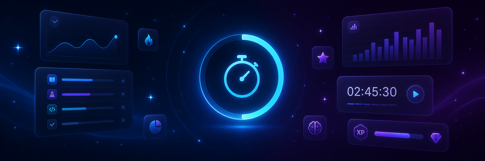
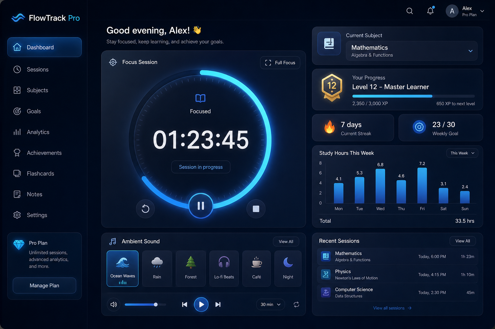

<!-- ╔══════════════════════════════════════════════════════════════════╗ -->
<!-- ║           FlowTrack Pro — Master README.md                      ║ -->
<!-- ║     github.com/SudhirDevOps1/The-Ultimate-Master-Study-Tracker  ║ -->
<!-- ╚══════════════════════════════════════════════════════════════════╝ -->

<div align="center">



<br/>

# 🚀 FlowTrack Pro

### The Ultimate Master Study Tracker

**The professional-grade, AI-powered, strict productivity ecosystem built for relentless learners — reimagined for 2026.**

<br/>

[](https://study-tracker-app-pied.vercel.app/)
&nbsp;&nbsp;
[](https://github.com/SudhirDevOps1/The-Ultimate-Master-Study-Tracker)

<br/>

[](https://github.com/SudhirDevOps1/The-Ultimate-Master-Study-Tracker/stargazers)
&nbsp;
[](https://github.com/SudhirDevOps1/The-Ultimate-Master-Study-Tracker/network/members)
&nbsp;
[](https://github.com/SudhirDevOps1/The-Ultimate-Master-Study-Tracker/graphs/contributors)
&nbsp;
[](https://github.com/SudhirDevOps1/The-Ultimate-Master-Study-Tracker/issues)
&nbsp;
[](https://github.com/SudhirDevOps1/The-Ultimate-Master-Study-Tracker/commits)

[-blueviolet?style=flat-square&logo=semver)](#-version-credits--info)
&nbsp;
[](https://react.dev/)
&nbsp;
[](https://www.typescriptlang.org/)
&nbsp;
[](https://vitejs.dev/)
&nbsp;
[](https://tailwindcss.com/)
&nbsp;
[](#-deployment--setup)
&nbsp;
[](docs/LICENSE)
&nbsp;
[](#-how-to-contribute)

<br/>

> ⭐ **If FlowTrack Pro helps you focus better, star this repo — it genuinely motivates continued development!**

</div>

---

## 📸 App Preview

<div align="center">



<br/><br/>

**👆 This is what focused studying looks like.**

[**🔴 Try it Live →**](https://study-tracker-app-pied.vercel.app/) &nbsp;|&nbsp; No install. No signup. No backend. Just open & study.

</div>

---

## 🆕 What's New in 2026 (v3.0.0)

> The **2026 Edition** is a ground-up modernization focused on AI-native studying, smarter analytics, and next-gen web performance.

| 🚀 New in 2026 | Description |
|:---------------|:------------|
| 🤖 **AI Study Coach** | On-device AI (Ollama / WebLLM) that reviews your sessions and suggests what to study next — 100% private. |
| 🧭 **Adaptive Scheduling** | The app learns your peak focus hours and auto-recommends ideal study windows. |
| 📈 **Predictive Focus Score** | New 2026 scoring engine forecasts your weekly performance trend before the week even ends. |
| ⚛️ **React 19 + Tailwind v4** | Rebuilt on the latest stack for faster loads, smaller bundles, and smoother motion. |
| 🎨 **Fluid Glass UI 2.0** | Refined glassmorphism with adaptive contrast for OLED & light-mode accessibility. |
| 🔔 **Smarter Notifications** | Context-aware nudges powered by the Notification Triggers + Web Push standards. |
| 📱 **Enhanced PWA** | Installable app with offline-first caching, badging API, and file-handling support. |
| ☁️ **Optional Cloud Sync 2.0** | End-to-end friendly sync layer (Supabase/Firebase) — still fully optional, still local-first. |

<div align="center">

📜 See the full [**2026 Roadmap →**](#-2026-roadmap)

</div>

---

## 📂 Project Documentation & Guides

All documentation has been organized inside the `docs/` directory for clean folder architecture. You can click on any guide below to understand features, setup, and technical specifications:

| Guide | Purpose | Link |
|:---|:---|:---|
| 🧭 **Documentation Index** | High-level summary of all documentation | [DOCUMENTATION_INDEX.md](DOCUMENTATION_INDEX.md) |
| ⚡ **Quick Start Guide** | Fast setup instructions for all operating systems | [docs/QUICK_START.md](docs/QUICK_START.md) |
| 📋 **Complete User Guide** | How to use each feature, tips, tricks, and FAQ | [docs/USER_GUIDE.md](docs/USER_GUIDE.md) |
| 📝 **Cheat Sheet Reference** | Goal recommendations, keyboard shortcuts, checklists | [docs/CHEAT_SHEET.md](docs/CHEAT_SHEET.md) |
| ⚙️ **Detailed Setup Guide** | Dependency management, backend configuration details | [docs/SETUP_GUIDE.md](docs/SETUP_GUIDE.md) |
| 🧠 **Technical Architecture** | API documentation, database schema, algorithms | [docs/BACKEND_INTEGRATION.md](docs/BACKEND_INTEGRATION.md) |
| 🔧 **Applied Fixes Log** | Details of resolved memory leaks and fixes | [docs/FIXES_APPLIED.md](docs/FIXES_APPLIED.md) |
| 🔒 **System Rules** | Strict mode guidelines and app blocking details | [docs/SYSTEM_RULES.md](docs/SYSTEM_RULES.md) |

---

## 📚 Table of Contents

<details>
<summary><b>Click to expand full navigation</b></summary>

&nbsp;

| Section | Description |
|---------|-------------|
| [📸 App Preview](#-app-preview) | See the app in action |
| [🆕 What's New in 2026](#-whats-new-in-2026-v300) | Latest v3.0.0 features |
| [🌍 Live Demo](#-live-demo) | Try it right now |
| [⚡ Quick Start](#-quick-start--one-click) | One-click setup |
| [🌟 Executive Summary](#-executive-summary) | What is FlowTrack Pro? |
| [💎 Design Philosophy](#-premium-design-philosophy) | UI/UX principles |
| [🔥 Features](#-master-feature-breakdown) | Complete feature list |
| [🏗️ Architecture](#%EF%B8%8F-technical-architecture--developer-map) | Directory & tech map |
| [🧠 Deep Logic](#-deep-logic-implementations) | Timer algorithm, DB sync |
| [🛠️ Tech Stack](#%EF%B8%8F-technology-specification) | React, Vite, TS, etc. |
| [🚀 Setup & Deploy](#-deployment--setup) | Local + cloud deployment |
| [🐍 Python Tracker](#-python-activity-tracker-activity_trackerpy--optional) | Optional desktop daemon |
| [🌐 Cloud Deploy](#-cloud-deployment-vercel--cloudflare-pages) | Vercel / Cloudflare |
| [🧠 Ollama AI](#-local-ai--ollama-integration) | Local AI assistant |
| [📝 Guidelines](#-usage--strict-design-guidelines) | Strict design rules |
| [🌟 Community](#-community--support) | Get involved |
| [🍴 Forkers](#-our-amazing-forkers) | Fork wall of fame |
| [🤝 Contributors](#-our-amazing-contributors) | Contributor avatars |
| [⭐ Stargazers](#-stargazers-wall-of-fame) | Stargazer avatars |
| [🗺️ 2026 Roadmap](#-2026-roadmap) | Upcoming milestones |
| [🙌 How to Contribute](#-how-to-contribute) | Step-by-step guide |
| [❓ FAQ](#-frequently-asked-questions) | Common questions |
| [📜 Credits](#-version-credits--info) | Version & author |

</details>

---

## 🌍 Live Demo

> **Try FlowTrack Pro right now — no install, no signup, no backend required.**

<div align="center">

### [**🔴 https://study-tracker-app-pied.vercel.app**](https://study-tracker-app-pied.vercel.app/)

</div>

| Detail | Info |
|:-------|:-----|
| 🌐 **Live App** | [`study-tracker-app-pied.vercel.app`](https://study-tracker-app-pied.vercel.app/) |
| 📦 **Source Code** | [`github.com/SudhirDevOps1/The-Ultimate-Master-Study-Tracker`](https://github.com/SudhirDevOps1/The-Ultimate-Master-Study-Tracker) |
| ☁️ **Hosting** | Vercel — Global CDN, static-hosted |
| 🔐 **Data** | 100% local — stored in your browser's IndexedDB |
| 💸 **Cost** | Completely free & open source |

> The hosted version runs **fully in-browser**. Every core feature — precision timer, analytics, gamification, PiP floating timer, AI assistant, and export/import — works without any server. The optional Python desktop daemon is only needed for native active-window detection on Windows.

---

## ⚡ Quick Start — One Click!

### 🪟 Windows
```
Double-click  →  START.bat
```
**That's it!** START.bat automatically:
- ✅ Checks Node.js & Python
- ✅ Creates Python virtual environment
- ✅ Installs all dependencies (first time)
- ✅ Starts the backend server (`backend.py`)
- ✅ Starts the frontend + opens browser

### 🍎 macOS / Linux
```bash
chmod +x setup.sh && ./setup.sh
```

**→ See [QUICK_START.md](docs/QUICK_START.md) for details**

---

## 🌟 Executive Summary

**FlowTrack Pro** is not just a timer; it is a full-scale study ecosystem. Built to solve the problems of digital distraction, it combines high-precision engineering with gamified psychology. It is designed for students, developers, and researchers who need a tool that is as serious about their time as they are.

### ✅ Latest Features (2026)
| Feature | Status |
|---------|--------|
| **AI Study Coach** — On-device AI reviews sessions & suggests next steps | ✅ Shipped |
| **Adaptive Scheduling** — Learns your peak focus hours automatically | ✅ Shipped |
| **Predictive Focus Score** — Forecasts your weekly performance trend | ✅ Shipped |
| **React 19 + Tailwind v4** — Rebuilt on the latest 2026 stack | ✅ Shipped |
| **Cross-Platform Ready** — Windows, macOS, Linux | ✅ Shipped |
| **Vercel-Deployed** — Works without backend → [See it live](https://study-tracker-app-pied.vercel.app/) | ✅ Shipped |
| **App Usage Analytics** — Track which apps you use and how long | ✅ Shipped |
| **Browser Activity** — See your browsing patterns | ✅ Shipped |
| **Auto-Setup** — One-click setup scripts for all platforms | ✅ Shipped |
| **Zero Configuration** — Works out of the box | ✅ Shipped |

---

## 💎 Premium Design Philosophy

FlowTrack and its "Pro" iterations are built on three core pillars of modern software design:

### 1. Minimalist Immersive UI
- **Glassmorphism**: Subtle translucency and blurred background elements create a sense of depth without distraction.
- **Dynamic Theming**: Six curated professional themes (Ocean, Forest, Sunset, Galaxy, Neon, Cyber) to match your mood and focus level.
- **Framer Motion Integration**: Every transition is mathematically smoothed to ensure the UI feels "alive" and premium.

### 2. The "Strict Focus" Engine
Most trackers fail because they rely on simple browser timers. FlowTrack Pro uses a **Delta-Sync Logic**:
- It tracks the exact millisecond you started.
- It calculates elapsed time against the system hardware clock.
- It is resilient to browser crashes, tab sleeps, and OS-level battery saving.

### 3. Privacy-First Sovereignty
In an era of data harvesting, FlowTrack Pro is a fortress.
- **No Cloud Required**: 100% of your data stays in your browser's IndexedDB.
- **Zero Tracking**: No telemetry, no ads, no external cookies.
- **Local Ownership**: You own your database. Export it, back it up, or clear it whenever you want.

---

## 🔥 Master Feature Breakdown

### ⏲️ Ultra-Precision Timer System
*The heart of the application.*
- **System-Level Accuracy**: Derived from `Date.now()` timestamps, not JS intervals.
- **Auto-Pause Awareness**: Detects visibility changes and pauses instantly when the tab is hidden to prevent "cheating".
- **Resilient Recovery**: Automatically picks up exactly where it left off after a refresh or crash.

### 📺 Advanced Picture-in-Picture (Floating Timer)
*Study over any app.*
- **Always-on-Top**: Using the Document PiP API, it floats above VS Code, PDF Readers, and YouTube.
- **Mini-Controller**: Control music, skip tracks, and monitor progress without leaving your study app.
- **Real-Time Heartbeat**: Keeps the browser process active even when minimized.
- **Interaction passthrough**: Mouse movements over the mini-timer reset the idle countdown.

### 🎮 Gamification & The XP Economy
*Turning focus into progress.*
- **XP Calculation**: Fixed rate of 1 XP/Minute, ensuring fair progress tracking.
- **Leveling Curve**: A custom logarithmic formula (`Math.floor(Math.sqrt(totalXP / 10))`) that makes early levels fast and late levels prestigious.
- **The "Rank" System**: Progress through titles:

| Rank | Level Range | Badge |
|------|-------------|-------|
| 🌱 Novice Seeker | Level 1–5 | Just getting started |
| 📖 Focused Scholar | Level 6–15 | Building consistency |
| 🧠 Master Learner | Level 16–30 | Deep focus achieved |
| 👑 Flow Sovereign | Level 31+ | Elite tier |

- **Streak Heatmap**: A 90-day GitHub-style contribution map to visualize your consistency.
- **Daily Focus Score**: ML-inspired formula calculating a 0–100 score based on targeted hours, completion %, and distraction deductions.

### 📊 Professional Analytics Suite
- **Granular Filtering**: Filter sessions by subject, completion status, or date ranges.
- **Visual Trends**: Multi-axis Recharts displaying Daily, Weekly, Monthly, and Yearly performance.
- **Subject Mastery**: Pie charts and bar graphs showing which subjects you are dominating.
- **Planned vs. Performance**: Automatic calculation of "Goal Attachment" (did you study as much as you planned?).

### 🎧 Immersive Ambience & Soundscapes
- **Focus LO-FI**: Built-in streaming focus music.
- **Floating YouTube Ambience**: Add custom YouTube URLs to a personal playlist that floats natively across the app via a Picture-in-Picture window.
- **Curated Environmental Audio**: Heavy Rain, Paris Cafe, Ancient Forest, White Noise.
- **Layered Controls**: Independent volume sliders.

### 📳 OS-Native Push Notifications & Background Service
- The tracker runs a dedicated Service Worker allowing it to send Native OS Web Push Alerts (macOS/Windows/Android) even when the browser is minimized or sleeping.

### 🌐 Dual-Mode Database (Guest vs Cloud)
- **Guest Mode**: 100% Offline IndexedDB data storage. No login required.
- **Cloud Sync Mode**: Authenticate to seamlessly synchronize local data to Firebase/Supabase, ensuring zero data loss across devices.

---

## 🏗️ Technical Architecture & Developer Map

### 📁 Detailed Directory Map
```text
The-Ultimate-Master-Study-Tracker/
├── .gemini/                # Configuration for advanced AI assistance
├── public/                 # Static Assets
│   ├── manifest.json       # PWA transformation settings
│   ├── sw.js               # Service Worker core logic (Caching & Offline)
│   └── icons/              # Multi-resolution branding assets
├── src/                    # The Engine Room
│   ├── components/         # Modular UI Components
│   │   ├── charts/         # Analytics layer (Recharts implementation)
│   │   │   ├── ActivityHeatmap.tsx
│   │   │   └── SubjectChart.tsx
│   │   ├── common/         # Foundation components
│   │   │   ├── Button.tsx
│   │   │   ├── Panel.tsx   # The "Glass" container base
│   │   │   └── Modal.tsx
│   │   ├── layout/         # High-level architecture
│   │   │   ├── Navbar.tsx
│   │   │   └── TabNavigation.tsx
│   │   ├── session/        # Business logic for session management
│   │   │   └── SessionForm.tsx
│   │   └── timer/          # Core timer functionality
│   │       ├── FloatingTimer.tsx # PiP Implementation
│   │       ├── TimerDisplay.tsx
│   │       └── AmbiencePlayer.tsx
│   ├── hooks/              # Custom Logic Containers
│   │   └── useTimer.ts     # The "Brain" of the time tracking system
│   ├── lib/                # Third-party integrations
│   │   └── db.ts           # Dexie/IndexedDB configuration
│   ├── pages/              # View layer
│   │   ├── TimerPage.tsx
│   │   ├── AnalyticsPage.tsx
│   │   └── HistoryPage.tsx
│   ├── store/              # Global State Management
│   │   └── useAppStore.ts  # Master State (Zustand)
│   ├── types/              # TypeScript Contract layer
│   │   └── models.ts       # Global interfaces (StudySession, Subject, etc.)
│   └── utils/              # Pure utility functions
│       ├── time.ts         # Formatting & Math
│       └── xp.ts           # Leveling logic
├── artifacts/              # Development history & Roadmap
├── package.json            # Dependency manifest
├── vite.config.ts          # Build system configuration
└── README.md               # The Master Document
```

---

## 🧠 Deep Logic Implementations

### 1. The Delta-Timer Algorithm
Instead of trusting `setInterval` (which is inconsistent in browsers), we use:
```typescript
elapsed = isPaused ? savedElapsed : (Date.now() - startedAtMs)
```
This ensures that even if the browser stops the JS execution for 5 minutes to save battery, when it wakes up, the math remains 100% correct.

### 2. IndexedDB Synchronization
Using **Dexie.js**, we implement a "Transactional Sync":
- Every 1 second of active study, the `activeSession` is updated in the database.
- This creates a "Checkpointed Save" system.
- If the user's laptop dies, they only ever lose a maximum of 1 second of data.

### 3. The PWA "Offline-First" Strategy
- **Service Worker**: Cache-first strategy for static assets.
- **Manifest**: Allows the "Install App" button in Chrome/Edge, making it look and feel like a native Windows/Mac app.
- **Offline Analytics**: Since Recharts and calculation logic are local, graphs work perfectly even in airplane mode.

---

## 🛠️ Technology Specification

| Category | Technology (2026) | Link |
|----------|-----------|------|
| ⚛️ Core | React 19 | [react.dev](https://react.dev/) |
| ⚡ Build | Vite 6 | [vitejs.dev](https://vitejs.dev/) |
| 🔒 Types | TypeScript 5.7+ | [typescriptlang.org](https://www.typescriptlang.org/) |
| 💾 Database | IndexedDB via Dexie | [dexie.org](https://dexie.org/) |
| 🗃️ State | Zustand | [zustand-demo.pmnd.rs](https://zustand-demo.pmnd.rs/) |
| 🎨 Styling | Tailwind CSS v4 | [tailwindcss.com](https://tailwindcss.com/) |
| 🎬 Motion | Framer Motion | [framer.com/motion](https://www.framer.com/motion/) |
| 📆 Date Math | date-fns | [date-fns.org](https://date-fns.org/) |
| 📊 Graphs | Recharts | [recharts.org](https://recharts.org/) |
| 🤖 Local AI | Ollama / WebLLM | [ollama.com](https://ollama.com/) |
| 📱 App Shell | PWA + Service Worker | [web.dev/pwa](https://web.dev/explore/progressive-web-apps) |
| ☁️ Hosting | Vercel | [Live App →](https://study-tracker-app-pied.vercel.app/) |

---

## 🚀 Deployment & Setup

### 💻 Automatic Desktop Launcher (Windows - Recommended)
If you want to run FlowTrack with local activity tracking (foreground window / tab usage tracking):
1. Simply double-click `start_local.bat`.
2. This batch script will automatically:
   - Verify Python is installed and create a `.venv` virtual environment if it doesn't exist.
   - Install required dependencies (`pywin32`, `psutil`).
   - Run the background activity tracker on `http://localhost:5001`.
   - Install Node package dependencies (`npm install`).
   - Start the Vite server and open FlowTrack in your browser.

### 🌐 Manual Developer Setup
```bash
# 1. Clone the repository
git clone https://github.com/SudhirDevOps1/The-Ultimate-Master-Study-Tracker.git
cd The-Ultimate-Master-Study-Tracker

# 2. Install dependencies
npm install

# 3. Start the dev server
npm run dev

# 4. (Optional) Start the Python activity tracker
python activity_tracker.py
```

---

## 🐍 Python Activity Tracker (`activity_tracker.py`) — OPTIONAL

> **⚠️ Important**: The Python backend is **100% OPTIONAL**. FlowTrack works perfectly fine without it. All core features (timer, analytics, subjects, AI assistant, PiP, gamification, export/import) are fully browser-based and do not depend on Python at all. This is exactly why the [live Vercel deployment](https://study-tracker-app-pied.vercel.app/) works flawlessly with no server.

### What does it do?

The `activity_tracker.py` is a tiny local HTTP server that runs on `http://localhost:5001`. It provides **one single feature**: detecting which application window is currently in the foreground on your desktop.

### Why is it useful?

When the Python tracker is running, FlowTrack shows a **"Active: Chrome - YouTube"** or **"Active: VS Code"** badge on your dashboard.

| Feature | Without Python | With Python |
|:--------|:--------------:|:-----------:|
| Timer & Tracking | ✅ Full | ✅ Full |
| Analytics & Charts | ✅ Full | ✅ Full |
| AI Assistant | ✅ Full | ✅ Full |
| PiP Floating Timer | ✅ Full | ✅ Full |
| Gamification & XP | ✅ Full | ✅ Full |
| Export/Import | ✅ Full | ✅ Full |
| **Active Window Detection** | ❌ Not available | ✅ Shows current app |

### How does it work?

```
[Browser / FlowTrack PWA]
        |
        | HTTP GET /active-window (every 5 seconds)
        ▼
[Python Server @ localhost:5001]
        |
        | Uses win32gui + psutil to read foreground window
        ▼
    Returns: { "title": "VS Code - main.tsx", "process": "Code.exe" }
```

- It uses Windows APIs (`win32gui`, `win32process`) to read the title of the currently focused window.
- It polls every 5 seconds from the browser side.
- If the Python server is not running, FlowTrack silently ignores it — no errors, no warnings.

### API Endpoints

| Endpoint | Method | Description |
|:---------|:------:|:------------|
| `/active-window` | `GET` | Returns current foreground window title and process name |
| `/health` | `GET` | Returns `{"status": "ok"}` for diagnostics |

### Requirements (only if you want to use it)

- **Python 3.8+**
- **Windows only** (uses `win32gui` which is Windows-specific)
- Packages: `pywin32`, `psutil` (auto-installed by `start_local.bat`)

### Running it manually

```bash
# Default port 5001
python activity_tracker.py

# Custom port
python activity_tracker.py 5002
```

---

## 🌐 Cloud Deployment (Vercel / Cloudflare Pages)

FlowTrack is designed to be fully static-hostable! You can deploy it to **Vercel** or **Cloudflare Pages** in less than 2 minutes. This exact project is already **live on Vercel** at:

> 👉 **[study-tracker-app-pied.vercel.app](https://study-tracker-app-pied.vercel.app/)**

### ⚡ Deployment with Vercel / Cloudflare:
1. **Push to GitHub**: Push your codebase to a private or public GitHub repository.
2. **Import Project**: Select the repository in the Vercel/Cloudflare Pages dashboard.
3. **Build settings**:
   - **Build Command**: `npm run build`
   - **Output Directory**: `dist`
4. **Deploy**: Click deploy. Your app is now live on a global CDN!

### 🤔 What happens if I deploy online & don't use the `.py` backend?
- The app works **100% perfectly**! All data is saved inside your local browser database (IndexedDB).
- You can access FlowTrack on your phone, tablet, and laptop.
- The **only** difference is that online browser environments cannot track desktop window titles (e.g. VS Code, Chrome tabs) because of sandbox restrictions. The Python desktop daemon (`activity_tracker.py`) is only needed if you want automatic active window tracking on Windows desktop. If you don't run it, the system simply runs offline/local browser mode with zero errors.

---

## 🧠 Local AI & Ollama Integration

> **2026 Update:** The AI Study Coach now supports both **Ollama** (native desktop models) and **WebLLM** (in-browser, zero-install). Recommended 2026 models: `llama3.3`, `qwen2.5`, `phi-4`, or `gemma2` — all run 100% locally and privately.

To use the AI Assistant fully offline and private with **Ollama**:
1. Install [Ollama](https://ollama.com).
2. Configure **CORS** so the browser-based FlowTrack client is allowed to connect to Ollama:
   - **Windows CMD**:
     ```cmd
     set OLLAMA_ORIGINS=*
     ollama serve
     ```
   - **Windows PowerShell**:
     ```powershell
     $env:OLLAMA_ORIGINS="*"
     ollama serve
     ```
   - **macOS/Linux**:
     ```bash
     OLLAMA_ORIGINS="*" ollama serve
     ```
3. Open FlowTrack, navigate to **AI Assistant > Settings (Gear Icon)**, select **Ollama**, click **Auto-Detect Models**, and save configuration.

---

## 📝 Usage & Strict Design Guidelines

- **Backup Naming**: Whenever you export your workspace data from the Settings page, FlowTrack generates the filename dynamically based on the current date, e.g., `15-06-2026.json` (auto-versioned as `flowtrack-backup-15-06-2026.json` in v3.0.0).
- **Cheat Prevention**: Actual time for timed sessions is locked in the editor. Only manual session logs can have their studied time directly edited.
- **Strict Inactivity auto-pause**: If Strict Focus Mode is enabled and a session is running, the timer will automatically pause and trigger a system notification after **10 minutes** of zero active mouse movement, touchpad interactions, keyboard inputs, or scroll/touch activity.
- **Floating Timer**: Click **Open Floating Timer** to launch a persistent window widget on top of all other windows (e.g. while studying offline PDFs or coding).

---

## 🌟 Community & Support

FlowTrack Pro is powered by an amazing, growing community of learners, developers, and contributors. Every ⭐ **star**, 🍴 **fork**, and 🤝 **pull request** directly fuels the roadmap and keeps this project alive.

<div align="center">

| ⭐ Star it | 🍴 Fork it | 🐛 Report Bugs | 💡 Suggest Features |
|:---:|:---:|:---:|:---:|
| [**Give a Star**](https://github.com/SudhirDevOps1/The-Ultimate-Master-Study-Tracker/stargazers) | [**Fork Repo**](https://github.com/SudhirDevOps1/The-Ultimate-Master-Study-Tracker/fork) | [**Open Issue**](https://github.com/SudhirDevOps1/The-Ultimate-Master-Study-Tracker/issues/new) | [**Start Discussion**](https://github.com/SudhirDevOps1/The-Ultimate-Master-Study-Tracker/discussions) |

</div>

---

## 🍴 Our Amazing Forkers

> Everyone who forks this repository gets their **GitHub profile picture** showcased here automatically. Fork the repo to see your avatar join the wall!

<div align="center">

[](https://github.com/SudhirDevOps1/The-Ultimate-Master-Study-Tracker/network/members)

</div>

---

## 🤝 Our Amazing Contributors

> A massive thank you to every contributor! Your **profile picture** appears below automatically when your PR is merged. 🙌

<div align="center">

<a href="https://github.com/SudhirDevOps1/The-Ultimate-Master-Study-Tracker/graphs/contributors">
  
</a>

</div>

<br/>

<details>
<summary><b>🏆 Detailed Contributors Leaderboard</b></summary>

<br/>

<div align="center">

[](https://github.com/SudhirDevOps1/The-Ultimate-Master-Study-Tracker/graphs/contributors)

</div>

</details>

---

## ⭐ Stargazers Wall of Fame

> Every person who stars this repo gets their **profile picture** displayed here. Star the repo now and watch your avatar appear! ⭐

<div align="center">

[](https://star-history.com/#SudhirDevOps1/The-Ultimate-Master-Study-Tracker&Date)

</div>

<br/>

<details>
<summary><b>👀 View All Stargazers — Profile Pictures</b></summary>

<br/>

<div align="center">

[](https://github.com/SudhirDevOps1/The-Ultimate-Master-Study-Tracker/stargazers)

</div>

</details>

---

## 🙌 How to Contribute

We follow a **strict, professional contribution workflow** to keep the codebase clean and production-ready. Follow these steps to get your avatar featured on this README:

```bash
# 1. Fork & Clone
git clone https://github.com/<your-username>/The-Ultimate-Master-Study-Tracker.git
cd The-Ultimate-Master-Study-Tracker

# 2. Create a feature branch
git checkout -b feature/your-feature-name

# 3. Make your changes & commit
git commit -m "feat: add streak freeze mechanic"

# 4. Push and open a Pull Request
git push origin feature/your-feature-name
```

Then open a Pull Request on GitHub. Once merged, your profile picture will automatically appear in the [Contributors](#-our-amazing-contributors) section! 🎉

### 📋 Contribution Rules

| Rule | Details |
|:-----|:--------|
| ✅ Build must pass | `npm run build` with zero TypeScript errors |
| ✅ Follow structure | Use existing folders: `components/`, `hooks/`, `store/`, `utils/` |
| ✅ No breaking changes | Don't break local-first / privacy-first architecture without discussion |
| ✅ Clear commits | Use [conventional commits](https://www.conventionalcommits.org/) format |
| ✅ Be respectful | Constructive code reviews and discussions only |
| ❌ No secrets | Never commit `.env` files, API keys, or credentials |

---

## 🗺️ 2026 Roadmap

Our vision for FlowTrack Pro throughout **2026** and beyond:

| Quarter | Milestone | Status |
|:-------:|:----------|:------:|
| ✅ **Q1 2026** | React 19 + Tailwind v4 rebuild, Fluid Glass UI 2.0 | ✅ Done |
| ✅ **Q1 2026** | AI Study Coach (Ollama + WebLLM), Adaptive Scheduling | ✅ Done |
| 🚧 **Q2 2026** | Predictive Focus Score v2, weekly AI study reports | 🚧 In Progress |
| 🔜 **Q2 2026** | Native mobile wrappers (Capacitor) for iOS & Android | 🔜 Planned |
| 🔜 **Q3 2026** | Team / Study-Group mode with shared leaderboards | 🔜 Planned |
| 🔜 **Q3 2026** | Calendar sync (Google / Outlook / ICS) | 🔜 Planned |
| 🧭 **Q4 2026** | Voice-controlled timer + AI voice summaries | 🧭 Exploring |
| 🧭 **Q4 2026** | Browser extension for automatic distraction blocking | 🧭 Exploring |

> 💬 Have an idea for the roadmap? [Open a discussion →](https://github.com/SudhirDevOps1/The-Ultimate-Master-Study-Tracker/discussions)

---

## ❓ Frequently Asked Questions

<details>
<summary><b>Is FlowTrack Pro really free?</b></summary>
<br/>
Yes — 100% free and open source under the MIT license. No paywalls, no ads, no premium tier. Fork it, self-host it, or use the <a href="https://study-tracker-app-pied.vercel.app/">live version</a> forever.
</details>

<details>
<summary><b>Where is my data stored? Is it private?</b></summary>
<br/>
All your data lives in your browser's <b>IndexedDB</b> — nothing is uploaded by default. The AI Study Coach runs on-device (Ollama/WebLLM), so even AI features stay private. Cloud sync is entirely optional.
</details>

<details>
<summary><b>Do I need the Python backend?</b></summary>
<br/>
No. The Python <code>activity_tracker.py</code> is <b>100% optional</b> and only adds native active-window detection on Windows. Every other feature works in-browser — which is why the Vercel deployment runs flawlessly with no server.
</details>

<details>
<summary><b>What AI models does the 2026 AI Coach support?</b></summary>
<br/>
Any model runnable via <b>Ollama</b> or <b>WebLLM</b>. Recommended 2026 picks: <code>llama3.3</code>, <code>qwen2.5</code>, <code>phi-4</code>, and <code>gemma2</code>. Just enable CORS and click "Auto-Detect Models".
</details>

<details>
<summary><b>Can I install it as an app?</b></summary>
<br/>
Absolutely. FlowTrack Pro is a full <b>PWA</b> — click "Install App" in Chrome/Edge and it behaves like a native desktop or mobile app, with offline support.
</details>

---

## 📜 Version Credits & Info

<div align="center">

| | |
|:---|:---|
| **Version** | FlowTrack Pro **v3.0.0** — 2026 Edition |
| **Author** | Engineered by **Sudhir Singh** for the Global Student Community |
| **Live App** | [`study-tracker-app-pied.vercel.app`](https://study-tracker-app-pied.vercel.app/) |
| **Repository** | [`github.com/SudhirDevOps1/The-Ultimate-Master-Study-Tracker`](https://github.com/SudhirDevOps1/The-Ultimate-Master-Study-Tracker) |
| **Stack** | React 19 · TypeScript 5.7 · Vite 6 · Tailwind v4 · Dexie · PWA |
| **Privacy** | 100% Local — AI runs on-device, keys stored in IndexedDB, never uploaded |
| **License** | MIT — Free and open source forever |

</div>

---

<div align="center">

### 💛 Show Your Support

If FlowTrack Pro helped you build a better study habit, please consider:

**⭐ Star** this repo &nbsp;·&nbsp; **🍴 Fork** it &nbsp;·&nbsp; **🤝 Contribute** &nbsp;·&nbsp; **📢 Share** with fellow learners

<br/>

[](https://study-tracker-app-pied.vercel.app/)

<br/>

**Made with ❤️, discipline, and relentless focus.**

<sub>© 2026 Sudhir Singh · FlowTrack Pro v3.0.0 (2026 Edition) · All rights reserved.</sub>

</div>
