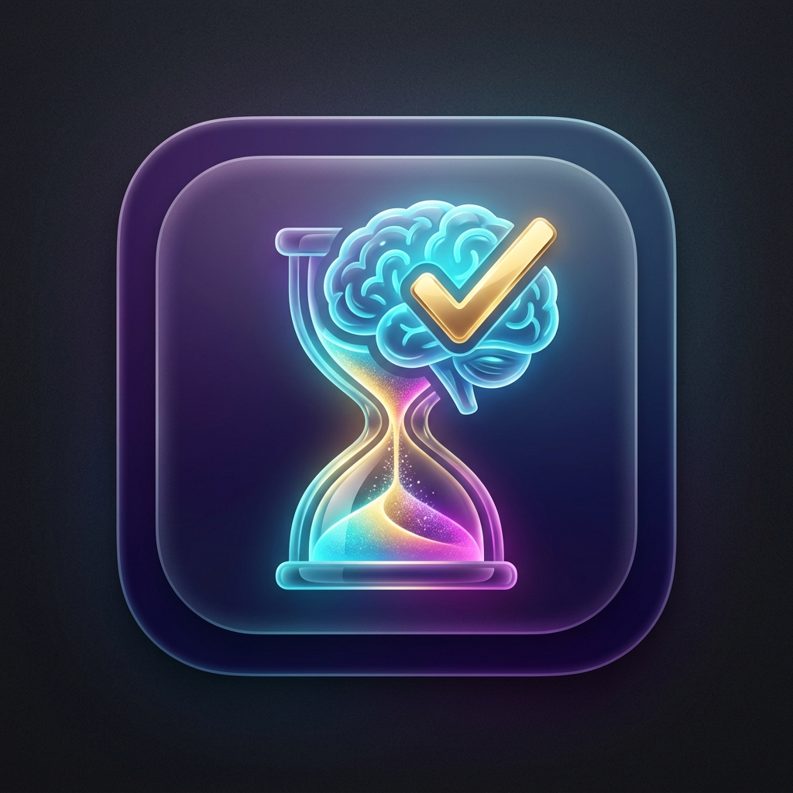
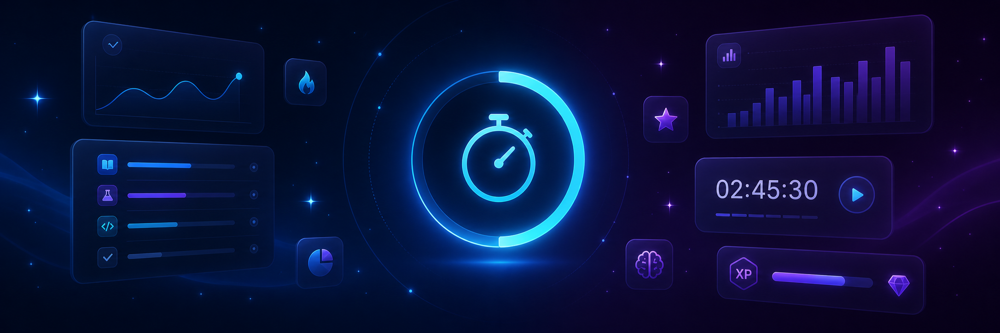
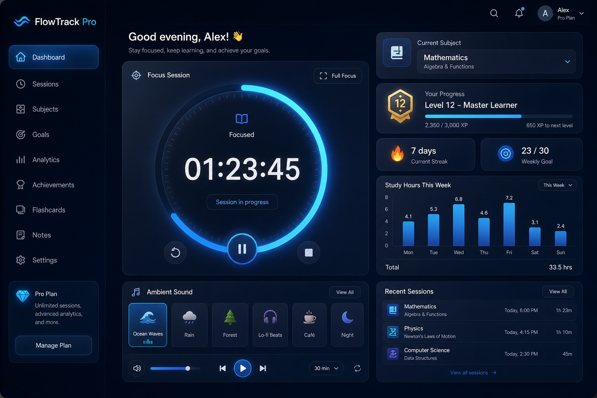

<div align="center">



# 🚀 FlowTrack Pro (v7.1.0 — Encrypted Vault & Auto-Updater Edition)

### 💎 The Ultimate Master Study & Productivity Ecosystem — 2026 Edition



**The professional-grade, AI-powered, strict study tracker built for relentless learners.**  
Engineered into **3 distinct operational categories**: Serverless Web App, Web App + Python Backend, and Standalone Windows Desktop App.

<p align="center">
  
  
  
  
  
  
</p>

[🌐 Live Web Demo](https://the-ultimate-master-study-tracker.vercel.app/) • [⚙️ Setup Guide](#-how-to-run-each-category) • [📜 System Architecture](docs/FULL_SYSTEM_GUIDE.md) • [📬 Contact Support](#-official-developer-social-profiles)

</div>

---

## 📸 Live Application Visual Interface

<div align="center">
  
  <p><i>FlowTrack Pro v7.0.0 — Smart Study Timer, In-App Web Browser, Course Media Sandbox & Focus Dashboard</i></p>
</div>

---

## 👤 Author & Project Metadata

| Attribute | Specification & Official Link |
|:---|:---|
| 🖼️ **Official App Icon** |  **FlowTrack Brand Logo** (`public/images/flowtrack-logo.png`) |
| 👑 **Project Name** | **FlowTrack Pro** — The Ultimate Master Study Tracker |
| 🧑‍💻 **Lead Architect** | **Sudhir Singh** ([@SudhirDevOps1](https://github.com/SudhirDevOps1)) |
| 📦 **Release Version** | `v7.0.0` (2026 Web Portals Edition) |
| ⚖️ **License** | [MIT Open Source License](LICENSE) |
| 🌐 **Live Web Deployment** | [`https://the-ultimate-master-study-tracker.vercel.app/`](https://the-ultimate-master-study-tracker.vercel.app/) |
| 🐙 **Source Code Repository** | [`https://github.com/SudhirDevOps1/The-Ultimate-Master-Study-Tracker`](https://github.com/SudhirDevOps1/The-Ultimate-Master-Study-Tracker) |

---

## 🔗 Official Developer Social Profiles

Connect directly with the developer team & join the study ecosystem community:

<p align="left">
  <a href="https://github.com/SudhirDevOps1" target="_blank">
    
  </a>
  <a href="https://www.linkedin.com/in/sudhirdevops1" target="_blank">
    
  </a>
  <a href="https://instagram.com/sudhirdevops1" target="_blank">
    
  </a>
  <a href="mailto:sudhirdevops1@gmail.com" target="_blank">
    
  </a>
</p>

---

## ✨ Key Features in v6.0.0

### 🎬 1. Study Media Sandbox & Universal Local Media Engine
* ⚡ **Zero-CORS `local-media://` Protocol:** Plays local videos and audio files from **ALL Windows Drive Letters (`C:\` to `Z:\`)**, UNC network shares, and Unicode paths (fullwidth symbols `｜`, `&`, spaces, quotes) with zero security blocks.
* 📁 **Course Folder Auto-Playlists:** Input a folder path (e.g. `D:\Videos`) to auto-scan all video chapters and auto-play the next video on completion (`onEnded`).
* 📺 **VLC Media Player Launcher Fallback:** 1-click `🎬 Open in VLC` integration launching local files directly in `vlc.exe` if installed on PC.

### 🎵 2. Exclusive Single-Source Audio Engine & Studio Equalizer
* 🔇 **Exclusive Single-Source Audio:** Playing a local song or YouTube stream automatically silences background soundscapes (Rain, Forest, Coffee, River) so audio never overlaps.
* 🎛️ **Studio Audio Visualizer & Vinyl Record Spin:** Real-time 16-bar neon frequency equalizer visualizer and 3D spinning vinyl disc for local audio playback.
* 📜 **Scrollable Ambience Selector:** Custom scrollbar (`max-h-64 overflow-y-auto`) prevents soundscape selector overflow on all screen heights.

### 📱 3. Framework7 v9.1.1 UI & Desktop Floating Controls
* 🎨 **iOS/Material Hybrid Cards:** Integrated custom `.f7-card` panels and segmented tab bar viewports across the entire application interface.
* 🔍 **Enlarged Resizable Floating Player:** Scaled to `w-[440px]` (Medium) and `w-[560px]` (Large) with built-in playlist settings, volume controls, and size toggles.

### 📬 4. Developer Social Profiles & Support Center
* 🌐 **Official Social Badges:** Interactive 1-click handles for 🐙 **GitHub**, 💼 **LinkedIn**, 📸 **Instagram**, and ✉️ **Support Email**.
* 🔐 **Encrypted Contact Form:** Clean fields for Name, Email, Subject, and Detailed Message with direct Cloudflare Worker backend submission (`apnaform.workers.dev`).

---

## 📅 3-Category Operational Models

```
                                    ┌─────────────────────────────────────────┐
                                    │          🚀 FLOWTRACK PRO               │
                                    └────────────────────┬────────────────────┘
                                                         │
         ┌───────────────────────────────────────────────┼───────────────────────────────────────────────┐
         ▼                                               ▼                                               ▼
┌─────────────────────────────────┐             ┌─────────────────────────────────┐             ┌─────────────────────────────────┐
│       🌐 CATEGORY 1             │             │       🐍 CATEGORY 2             │             │       🖥️ CATEGORY 3             │
│    Web App (Serverless CDN)     │             │    Web App + Python Backend     │             │     Standalone Desktop App      │
│  - Live on Vercel CDN           │             │  - Browser UI + backend.py      │             │  - Standalone Electron .exe     │
│  - 100% In-Browser IndexedDB    │             │  - OS Active Window Tracking    │             │  - Win32 Kernel Tracking        │
│  - Zero Install & Zero Signup   │             │  - SQLite Database Sync         │             │  - System Tray Minimization     │
└─────────────────────────────────┘             └─────────────────────────────────┘             └─────────────────────────────────┘
```

---

## 🖥️ System & Resource Requirements

| Resource / Spec | 🌐 Category 1: Web App (Serverless) | 🐍 Category 2: Web App + Python | 🖥️ Category 3: Desktop App (Electron) |
|:---|:---|:---|:---|
| 💻 **Target OS** | Any OS (Windows/Mac/Linux/iOS/Android) | Windows 10/11, macOS, Linux | Windows 10 (64-bit) / Windows 11 |
| ⚡ **Minimum RAM** | **512 MB** available RAM | **1 GB** RAM | **2 GB** available RAM |
| 🚀 **Recommended RAM**| **1 GB - 2 GB** RAM | **2 GB - 4 GB** RAM | **4 GB - 8 GB** RAM |
| 💾 **Disk Storage** | ~20 MB (IndexedDB cache) | ~100 MB (Python + SQLite) | ~300 MB App Installation |
| ⚙️ **Installation** | Zero Install (Browser / PWA) | Python 3.8+ (`START.bat` / `setup.sh`) | Double-click `.exe` installer |
| 🐍 **Python Needed?** | ❌ None | ✅ Required (`backend.py`) | ❌ **NONE** (Embedded C# binary) |

---

## 🚀 How to Run Each Category

### 🌐 Category 1: Web App (No Backend)
```bash
npm install
npm run dev
# Open http://localhost:5173
```

### 🖥️ Category 3: Standalone Desktop App
```bash
cd desktop-app
npm install
npm run electron:dev

# Build Portable Executables & Windows Installers
npm run build:win
```

---

## 📜 License & Credits

Built with ❤️ by **Sudhir Singh** ([@SudhirDevOps1](https://github.com/SudhirDevOps1)).  
Licensed under the [MIT Open Source License](LICENSE).
