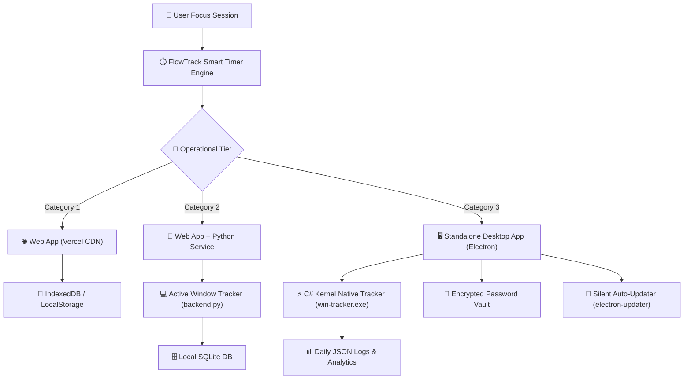

<div align="center">


# 🚀 FlowTrack Pro `v7.3.0`

### 💎 The Ultimate Master Study & Productivity Ecosystem — 2026 Enterprise Edition

<p align="center">
  <a href="https://github.com/SudhirDevOps1/The-Ultimate-Master-Study-Tracker/releases/tag/v7.3.0">
    
  </a>
  <a href="https://the-ultimate-master-study-tracker.vercel.app/">
    
  </a>
  <a href="LICENSE">
    
  </a>
  <a href="https://github.com/SudhirDevOps1/The-Ultimate-Master-Study-Tracker/actions">
    
  </a>
</p>

<p align="center">
  
  
  
  
  
  
</p>


**The professional-grade, AI-powered, strict study tracker built for relentless learners.**  
Engineered into **3 distinct operational tiers**: Serverless PWA Web App, Web App + Python Tracking Service, and Standalone Windows/macOS Desktop Application.

---

### 🌐 [Live Web App](https://the-ultimate-master-study-tracker.vercel.app/) • 📦 [Download Desktop Installer](https://github.com/SudhirDevOps1/The-Ultimate-Master-Study-Tracker/releases/tag/v7.3.0) • 📖 [Architecture Guide](docs/FULL_SYSTEM_GUIDE.md) • 📊 [Privacy Policy](docs/ANALYTICS_AND_TRACKING_POLICY.md)

</div>

---

## 📌 Executive Navigation & Table of Contents

```
├── 🗺️ Overview & Quick Links
├── 📸 Live Product Interface Showcase
├── 👤 Lead Architect & Project Specs
├── ✨ Key Features & Innovations in v7.3.0
├── 📂 Complete Repository Documentation Index
├── 🏛️ System Architecture & Data Flow
├── ⚡ Operational Tiers Comparison Matrix
├── 🖥️ System Requirements & Hardware Specs
├── 🚀 Installation & Developer Quickstart
└── 📜 License, Security & Support
```

- [📸 Live Product Interface Showcase](#-live-product-interface-showcase)
- [👤 Lead Architect & Project Specs](#-lead-architect--project-specs)
- [🔗 Developer Social & Community Profiles](#-developer-social--community-profiles)
- [✨ Key Features & Innovations in v7.3.0](#-key-features--innovations-in-v730)
- [📂 Comprehensive Documentation Directory](#-comprehensive-documentation-directory)
- [🏛️ System Architecture & Data Flow](#️-system-architecture--data-flow)
- [📊 Operational Tiers Feature Matrix](#-operational-tiers-feature-matrix)
- [🖥️ Hardware & Platform Requirements](#-hardware--platform-requirements)
- [🚀 Quickstart Guide & Installation](#-quickstart-guide--installation)
  - [🌐 Category 1: Web App (Zero Install)](#-category-1-serverless-web-app-zero-install)
  - [🐍 Category 2: Web App + Python Service](#-category-2-web-app--python-backend-service)
  - [🖥️ Category 3: Standalone Desktop App](#-category-3-standalone-desktop-application)
- [🛡️ Security Disclosures & Privacy Guarantee](#%EF%B8%8F-security-disclosures--privacy-guarantee)
- [📜 License & Credits](#-license--credits)

---

## 📸 Live Product Interface Showcase

<div align="center">
  
  <p><i>FlowTrack Pro v7.3.0 — Unified Study Workspace featuring Smart Timer, True Pitch-Black OLED Engine, Encrypted Vault & MindMap Whiteboard</i></p>
</div>

---

## 👤 Lead Architect & Project Specs

| Attribute | Specification & Verification Link |
|:---|:---|
| 🖼️ **Brand Identity** |  **FlowTrack Pro Official Symbol** ([view logo](public/images/flowtrack-logo.png)) |
| 👑 **Product Name** | **FlowTrack Pro** — Master Study & Productivity Ecosystem |
| 🧑‍💻 **Lead Developer** | **Sudhir Singh** ([@SudhirDevOps1](https://github.com/SudhirDevOps1)) |
| 📦 **Current Version** | `v7.3.0` (Production Master Release) |
| ⚖️ **License** | [MIT License](LICENSE) |
| 🌐 **Live Production Web** | [`https://the-ultimate-master-study-tracker.vercel.app/`](https://the-ultimate-master-study-tracker.vercel.app/) |
| 🐙 **GitHub Repository** | [`SudhirDevOps1/The-Ultimate-Master-Study-Tracker`](https://github.com/SudhirDevOps1/The-Ultimate-Master-Study-Tracker) |
| 📥 **Official Release Tag** | [`v7.3.0 GitHub Release`](https://github.com/SudhirDevOps1/The-Ultimate-Master-Study-Tracker/releases/tag/v7.3.0) |

---

## 🔗 Developer Social & Community Profiles

Connect with the author & join the FlowTrack Pro study ecosystem:

<p align="left">
  <a href="https://github.com/SudhirDevOps1" target="_blank">
    
  </a>
  <a href="https://www.linkedin.com/in/sudhirdevops1" target="_blank">
    
  </a>
  <a href="https://instagram.com/sudhirdevops1" target="_blank">
    
  </a>
  <a href="mailto:sudhirdevops1@gmail.com" target="_blank">
    
  </a>
</p>

---

## ✨ Key Features & Innovations in v7.3.0

> [!NOTE]
> FlowTrack Pro is engineered for zero-distraction, deep-work study sessions with native OS integration.

### 🖤 1. True Pitch-Black OLED Dark Theme Engine
* **0ms Startup Hydration:** Instant OLED Black (`#000000`) theme application at script load (0ms) across Web & Desktop apps.
* **100% OLED Contrast:** Pure black `#000000` body background, `#050505` glass cards, and high-visibility neon accent themes.

### 🎨 2. Dual-Engine MindMap & Excalidraw 0.18.1 Canvas
* **Vector Tree Visualizer:** Interactive tree node engine for structuring complex study topics and hierarchies.
* **Excalidraw 0.18.1 Whiteboard:** Dynamic Excalidraw dynamic loader bundled with complete 145 kB CSS stylesheets and WOFF2 vector font assets for flawless Vercel production rendering.

### 🔐 3. In-App Encrypted Credential Vault & Auto-Fill
* **Local Vault Security:** Store login credentials for PW, Apna College, Coursera, YouTube, and study portals securely inside `localStorage` using XOR/Base64 obfuscated ciphers.
* **1-Click DOM Injection Auto-Fill:** Interactive `🔑 Fill Login` button in browser address bar injects DOM scripts directly into embedded Chromium `<webview>` elements.

### 🔄 4. Background Silent Auto-Updater (`electron-updater`)
* **Silent Background Updates:** Background polling service automatically checks GitHub Releases 10 seconds post-launch.
* **1-Click Restart & Install:** Downloads release binaries in background with live progress indicators and a 1-click update installation button.

### 🛡️ 5. Anti-Cheat System Clock Guard & Security Hardening
* **Anti-Tamper Time Guard:** Validates system clock deltas to prevent users from artificially shifting Windows time forward to inflate study XP or instantly complete timer blocks.
* **Strict IPC Protocol Whitelist:** Blocks unauthorized OS protocol link execution, allowing only `http://`, `https://`, and `mailto:` links.

### 🌐 6. Embedded Chromium Web Portals Engine & Media Player
* **In-App Browser Sandbox:** Open course portals directly inside FlowTrack Pro without switching context.
* **Zero-CORS `local-media://` Protocol:** Stream local video and audio lectures directly from any drive letter (`C:\` to `Z:\`).

---

## 📂 Comprehensive Documentation Directory

Every component of the FlowTrack Pro ecosystem is thoroughly documented across specialized markdown guides:

| Document / Specs | Direct Link | Description & Key Topics Covered |
|:---|:---|:---|
| 🖥️ **Desktop App Guide** | [`desktop-app/README.md`](desktop-app/README.md) | Dedicated guide for Standalone Desktop App, Electron IPC API, and C# active window tracker. |
| 🌐 **Web App Guide** | [`web-app/README.md`](web-app/README.md) | Architectural setup for Serverless Web App on Vercel CDN with PWA offline caching. |
| 📊 **Analytics & Tracking Policy** | [`docs/ANALYTICS_AND_TRACKING_POLICY.md`](docs/ANALYTICS_AND_TRACKING_POLICY.md) | Data privacy specification, Win32 active window tracking mechanisms, and local storage safety. |
| 📖 **Full System Architecture** | [`docs/FULL_SYSTEM_GUIDE.md`](docs/FULL_SYSTEM_GUIDE.md) | Complete deep dive into Zustand state stores, IndexedDB schema, and procedural audio synthesis. |
| 📝 **Changelog & History** | [`web-app/CHANGELOG.md`](web-app/CHANGELOG.md) | Chronological version release logs from `v1.0.0` to `v7.3.0`. |

---

## 🏛️ System Architecture & Data Flow


```mermaid
graph TD
    A["👤 User Focus Session"] --> B["⏱️ FlowTrack Smart Timer Engine"]
    B --> C{"📱 Operational Tier"}
    
    C -->|"Category 1"| D["🌐 Web App (Vercel CDN)"]
    D --> E["💾 IndexedDB / LocalStorage"]
    
    C -->|"Category 2"| F["🐍 Web App + Python Service"]
    F --> G["💻 Active Window Tracker (backend.py)"]
    G --> H["🗄️ Local SQLite DB"]
    
    C -->|"Category 3"| I["🖥️ Standalone Desktop App (Electron)"]
    I --> J["⚡ C# Kernel Native Tracker (win-tracker.exe)"]
    I --> K["🔐 Encrypted Password Vault"]
    I --> L["🔄 Silent Auto-Updater (electron-updater)"]
    J --> M["📊 Daily JSON Logs & Analytics"]
```

---

## 📊 Operational Tiers Feature Matrix

| Feature / Capability | 🌐 Category 1: Web App | 🐍 Category 2: Web + Python | 🖥️ Category 3: Desktop App |
|:---|:---:|:---:|:---:|
| **Installation Required** | ❌ None (Zero Install) | ⚠️ Python 3.8+ Setup | ❌ **None** (Double-click `.exe`) |
| **Active OS App Tracking** | ❌ Domain Only | ✅ Full OS Active Window | ✅ **Kernel Win32 Tracking** |
| **System Tray Minimization** | ❌ No | ❌ No | ✅ **Full System Tray Support** |
| **Password Vault & Auto-Fill**| ⚠️ Web Storage Only | ⚠️ Web Storage Only | ✅ **Encrypted Vault + DOM Injection** |
| **Background Auto-Updater** | ❌ No | ❌ No | ✅ **Background Silent Auto-Update** |
| **Offline Performance** | ✅ Full PWA Offline | ✅ Local Server | ✅ **100% Standalone Offline** |
| **Resource Usage (RAM)** | ~50 MB - 100 MB | ~150 MB - 200 MB | ~100 MB - 180 MB |

---

## 🖥️ Hardware & Platform Requirements

> [!TIP]
> FlowTrack Pro is optimized to consume **< 0.5% CPU** in background mode.

| Specification | Minimum Requirement | Recommended Specification |
|:---|:---|:---|
| 💻 **Operating System** | Windows 10 (64-bit), macOS 11+, Linux | Windows 11 (64-bit) / macOS Sonoma |
| ⚡ **Processor (CPU)** | Intel Core i3 / AMD Ryzen 3 / Apple M1 | Intel Core i5 / AMD Ryzen 5 / Apple M-Series |
| 🧠 **Memory (RAM)** | **2 GB** available RAM | **4 GB - 8 GB** RAM |
| 💾 **Disk Storage** | ~150 MB free disk space | SSD storage (~200 MB) |
| 🌐 **Display Resolution** | 1280 x 720 (HD) | 1920 x 1080 (FHD) or higher |

---

## 🚀 Quickstart Guide & Installation

### 🌐 Category 1: Serverless Web App (Zero Install)
To launch the lightweight web application locally:
```bash
cd web-app
npm install
npm run dev
# Open http://localhost:5173 in any modern browser
```
👉 *Read Web App Documentation:* [`web-app/README.md`](web-app/README.md)

### 🐍 Category 2: Web App + Python Backend Service
To enable OS active window tracking in browser mode:
```bash
# 1. Start the Python tracking service
cd web-app
python backend.py

# 2. In a separate terminal, launch the Web UI
npm run dev
```

### 🖥️ Category 3: Standalone Desktop Application
To run the full-featured Desktop App with Password Vault & Auto-Updater:
```bash
cd desktop-app
npm install
npm run electron:dev

# Build compressed standalone installers (~150MB)
npm run electron:build
```
👉 *Read Desktop App Documentation:* [`desktop-app/README.md`](desktop-app/README.md)

---

## 🛡️ Security Disclosures & Privacy Guarantee

> [!IMPORTANT]
> **100% Privacy Preserved**: FlowTrack Pro operates **strictly offline-first**.

1. **No External Server Uploads**: Your study logs, task titles, active window titles, and credential vault remain stored **locally on your device**.
2. **Encrypted Vault Storage**: Credentials stored in the Password Vault are obfuscated using local ciphers and never transmitted over any network.
3. **Protocol Whitelisting**: External links opened from within the app are validated against a strict protocol whitelist (`http://`, `https://`, `mailto:`).

---

## 📜 License & Credits

Designed & Architected with ❤️ by **Sudhir Singh** ([@SudhirDevOps1](https://github.com/SudhirDevOps1)).  
Licensed under the [MIT Open Source License](LICENSE).  

For feature requests, bug reports, or enterprise feedback, feel free to file a [GitHub Issue](https://github.com/SudhirDevOps1/The-Ultimate-Master-Study-Tracker/issues) or reach out via [Support Email](mailto:sudhirdevops1@gmail.com).

<div align="center">
  <br />
  <a href="#-executive-navigation--table-of-contents">⬆️ Back to Top</a>
</div>
