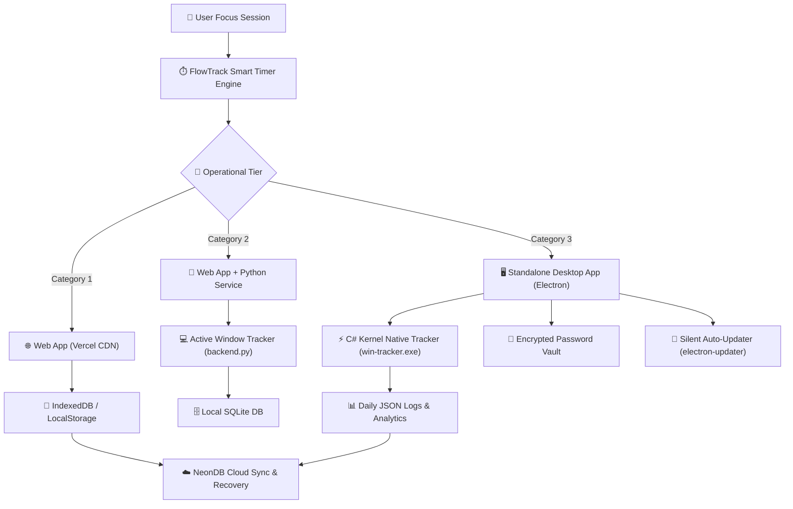

<div align="center">


<h1>🚀 FlowTrack Pro <code>v7.5.1</code></h1>
<h3>💎 The Ultimate Master Study &amp; Productivity Ecosystem — 2026 Enterprise Edition</h3>

<!-- Animated Typing SVG -->
<a href="https://github.com/SudhirDevOps1/The-Ultimate-Master-Study-Tracker">
  
</a>

<!-- Primary Action Badges -->
<p>
  <a href="https://github.com/SudhirDevOps1/The-Ultimate-Master-Study-Tracker/releases/tag/v7.5.1">
    
  </a>
  <a href="https://the-ultimate-master-study-tracker.vercel.app/">
    
  </a>
  <a href="LICENSE">
    
  </a>
  <a href="https://github.com/SudhirDevOps1/The-Ultimate-Master-Study-Tracker/actions">
    
  </a>
</p>

<!-- Social Stats Badges -->
<p>
  <a href="https://github.com/SudhirDevOps1/The-Ultimate-Master-Study-Tracker/stargazers">
    
  </a>
  <a href="https://github.com/SudhirDevOps1/The-Ultimate-Master-Study-Tracker/forks">
    
  </a>
  <a href="https://github.com/SudhirDevOps1/The-Ultimate-Master-Study-Tracker/issues">
    
  </a>
  <a href="https://github.com/SudhirDevOps1/The-Ultimate-Master-Study-Tracker/releases">
    
  </a>
  
</p>


<!-- Tech Stack Badges -->
<p>
  
  
  
  
  
  
  
</p>

<br />


<br />

> **The professional-grade, AI-powered, strict study tracker built for relentless learners.**
> Engineered into **3 distinct operational tiers**: Serverless PWA Web App, Web App + Python Tracking Service, and Standalone Windows/macOS Desktop Application.

<br />

### 🌐 [Live Web App](https://the-ultimate-master-study-tracker.vercel.app/) &nbsp;•&nbsp; 📦 [Download Desktop Installer](https://github.com/SudhirDevOps1/The-Ultimate-Master-Study-Tracker/releases/tag/v7.5.1) &nbsp;•&nbsp; 📖 [Architecture Guide](docs/FULL_SYSTEM_GUIDE.md) &nbsp;•&nbsp; 📊 [Privacy Policy](docs/ANALYTICS_AND_TRACKING_POLICY.md)

</div>

<br />

---

## 📌 Executive Navigation & Table of Contents

```text
├── 🆕 What's New in v7.5.1
├── 📸 Live Product Interface Showcase
├── 👤 Lead Architect & Project Specs
├── 🔗 Developer Social & Community Profiles
├── ✨ Key Features & Innovations
├── 📂 Complete Repository Documentation Index
├── 🏛️ System Architecture & Data Flow
├── ⚡ Operational Tiers Comparison Matrix
├── 🖥️ System Requirements & Hardware Specs
├── 🚀 Installation & Developer Quickstart
└── 📜 License, Security & Support
```

| Section | Jump Link |
|:---|:---|
| 🆕 What's New | [→ v7.5.1 Changelog](#-whats-new-in-v751) |
| 📸 Interface Showcase | [→ Screenshots](#-live-product-interface-showcase) |
| 👤 Author & Specs | [→ Project Info](#-lead-architect--project-specs) |
| ✨ Features | [→ All Features](#-key-features--innovations-in-v751) |
| 🚀 Install | [→ Quickstart](#-quickstart-guide--installation) |
| 🛡️ Security | [→ Privacy](#%EF%B8%8F-security-disclosures--privacy-guarantee) |

---

## 🆕 What's New in v7.5.1

> [!IMPORTANT]
> This is the latest stable production release. Update immediately for best performance.

| # | Change | Impact |
|:---:|:---|:---:|
| 🐛 | **Fixed** "Something went wrong" crash when opening new tab in Web Portals | 🔴 Critical |
| 🔐 | **Fixed** `Unauthorized IPC channel: get-desktop-settings` security error | 🔴 Critical |
| ☁️ | **Added** NeonDB cloud sync — restore all data after PC wipe from cloud | 🟢 Feature |
| 🔇 | **Removed** annoying SQL warning popups in production browser console | 🟡 UX |
| 🚫 | **Fixed** Popup/new-window hijacking in embedded webview browser | 🟡 UX |

---

## 📸 Live Product Interface Showcase

<div align="center">
  
  <br />
  <sub><i>FlowTrack Pro v7.5.1 — Unified Study Workspace featuring Smart Timer, True Pitch-Black OLED Engine, Encrypted Vault & MindMap Whiteboard</i></sub>
</div>

---

## 👤 Lead Architect & Project Specs

| Attribute | Specification & Verification Link |
|:---|:---|
| 🖼️ **Brand Identity** |  **FlowTrack Pro** ([view logo](public/images/flowtrack-logo.png)) |
| 👑 **Product Name** | **FlowTrack Pro** — Master Study & Productivity Ecosystem |
| 🧑‍💻 **Lead Developer** | **Sudhir Singh** ([@SudhirDevOps1](https://github.com/SudhirDevOps1)) |
| 📦 **Current Version** | `v7.5.1` — Production Master Release |
| ⚖️ **License** | [MIT Open Source License](LICENSE) |
| 🌐 **Live Production Web** | [`the-ultimate-master-study-tracker.vercel.app`](https://the-ultimate-master-study-tracker.vercel.app/) |
| 🐙 **GitHub Repository** | [`SudhirDevOps1/The-Ultimate-Master-Study-Tracker`](https://github.com/SudhirDevOps1/The-Ultimate-Master-Study-Tracker) |
| 📥 **Official Release** | [`v7.5.1 GitHub Release`](https://github.com/SudhirDevOps1/The-Ultimate-Master-Study-Tracker/releases/tag/v7.5.1) |
| ☁️ **Cloud Database** | NeonDB Serverless PostgreSQL (for cross-device sync & recovery) |

---

## 🔗 Developer Social & Community Profiles

<p align="center">
  <i>Connect with the author & join the FlowTrack Pro study ecosystem:</i>
</p>

<p align="center">
  <a href="https://github.com/SudhirDevOps1" target="_blank">
    
  </a>
  &nbsp;
  <a href="https://www.linkedin.com/in/sudhirdevops1" target="_blank">
    
  </a>
  &nbsp;
  <a href="https://instagram.com/sudhirdevops1" target="_blank">
    
  </a>
  &nbsp;
  <a href="mailto:sudhirdevops1@gmail.com" target="_blank">
    
  </a>
</p>

---

## ✨ Key Features & Innovations in v7.5.1

> [!NOTE]
> FlowTrack Pro is engineered for **zero-distraction**, deep-work study sessions with native OS integration.

<details open>
<summary><strong>🖤 1. True Pitch-Black OLED Dark Theme Engine</strong></summary>
<br />

* **0ms Startup Hydration:** Instant OLED Black (`#000000`) theme application at script load (0ms) across Web & Desktop apps.
* **100% OLED Contrast:** Pure black `#000000` body background, `#050505` glass cards, and high-visibility neon accent themes.

</details>

<details open>
<summary><strong>🎨 2. Dual-Engine MindMap & Excalidraw 0.18.1 Canvas</strong></summary>
<br />

* **Vector Tree Visualizer:** Interactive tree node engine for structuring complex study topics and hierarchies.
* **Excalidraw 0.18.1 Whiteboard:** Dynamic Excalidraw dynamic loader bundled with complete 145 kB CSS stylesheets and WOFF2 vector font assets for flawless Vercel production rendering.

</details>

<details open>
<summary><strong>🔐 3. In-App Encrypted Credential Vault & Auto-Fill</strong></summary>
<br />

* **Local Vault Security:** Store login credentials for PW, Apna College, Coursera, YouTube, and study portals securely inside `localStorage` using XOR/Base64 obfuscated ciphers.
* **1-Click DOM Injection Auto-Fill:** Interactive `🔑 Fill Login` button in browser address bar injects DOM scripts directly into embedded Chromium `<webview>` elements.

</details>

<details open>
<summary><strong>🔄 4. Background Silent Auto-Updater (<code>electron-updater</code>)</strong></summary>
<br />

* **Silent Background Updates:** Background polling service automatically checks GitHub Releases 10 seconds post-launch.
* **1-Click Restart & Install:** Downloads release binaries in background with live progress indicators and a 1-click update installation button.

</details>

<details open>
<summary><strong>🛡️ 5. Anti-Cheat System Clock Guard & Security Hardening</strong></summary>
<br />

* **Anti-Tamper Time Guard:** Validates system clock deltas to prevent users from artificially shifting Windows time forward to inflate study XP or instantly complete timer blocks.
* **Strict IPC Protocol Whitelist:** Blocks unauthorized OS protocol link execution, allowing only `http://`, `https://`, and `mailto:` links.

</details>

<details open>
<summary><strong>🌐 6. Embedded Chromium Web Portals Engine & Media Player</strong></summary>
<br />

* **In-App Browser Sandbox:** Open course portals directly inside FlowTrack Pro without switching context.
* **Zero-CORS `local-media://` Protocol:** Stream local video and audio lectures directly from any drive letter (`C:\` to `Z:\`).

</details>

---

## 📂 Comprehensive Documentation Directory

Every component of the FlowTrack Pro ecosystem is thoroughly documented across specialized markdown guides. All files are located within this repository:

### 🗂️ Root & Core Docs

| Document | Link | Description |
|:---|:---|:---|
| 📖 **Full System Architecture Guide** | [`docs/FULL_SYSTEM_GUIDE.md`](docs/FULL_SYSTEM_GUIDE.md) | Complete deep dive into Zustand state stores, IndexedDB schema, procedural audio synthesis & all 3 operational tiers. |
| 📊 **Analytics & Tracking Policy** | [`docs/ANALYTICS_AND_TRACKING_POLICY.md`](docs/ANALYTICS_AND_TRACKING_POLICY.md) | Exact data privacy specification — what is tracked, why, where it lives, and what is NEVER tracked. |
| 🗺️ **Future Roadmap (2026–2027)** | [`docs/FUTURE_ROADMAP.md`](docs/FUTURE_ROADMAP.md) | Planned features, upcoming modules, and enhancement roadmap across all 3 operational categories. |
| ☁️ **Cloud Architecture** | [`docs/cloud-architecture.md`](docs/cloud-architecture.md) | Guest Mode vs Cloud Mode architecture — IndexedDB local storage vs NeonDB/Firebase cloud sync. |
| 🔑 **Environment Setup Guide** | [`docs/ENV_SETUP_GUIDE.md`](docs/ENV_SETUP_GUIDE.md) | Step-by-step Firebase & Vercel environment variable setup for cloud sync deployment. |

---

### 🖥️ Desktop App Docs

| Document | Link | Description |
|:---|:---|:---|
| 🖥️ **Desktop App Guide** | [`desktop-app/README.md`](desktop-app/README.md) | Standalone Electron Desktop App guide — IPC API, C# Win32 active window tracker, Password Vault & Auto-Updater. |

---

### 🌐 Web App Docs

| Document | Link | Description |
|:---|:---|:---|
| 🌐 **Web App Overview** | [`web-app/README.md`](web-app/README.md) | Web Application module overview — IndexedDB offline persistence, PWA install, zero-signup architecture. |
| 🚀 **Quick Start Guide** | [`web-app/QUICK_START.md`](web-app/QUICK_START.md) | 1-click Windows launch guide using `START.bat` — auto-starts Python backend & Web UI together. |
| ⚙️ **Complete Setup Guide** | [`web-app/SETUP_GUIDE.md`](web-app/SETUP_GUIDE.md) | Full cross-platform setup for Windows, macOS & Linux — app tracking, browser analytics & productivity scoring. |
| 👤 **User Guide** | [`web-app/USER_GUIDE.md`](web-app/USER_GUIDE.md) | End-user guide covering Dashboard, Analytics, App Monitor, Timer, AI Study Assistant & Offline Mode. |
| ⌨️ **Cheat Sheet** | [`web-app/CHEAT_SHEET.md`](web-app/CHEAT_SHEET.md) | Quick-reference keyboard shortcuts, feature map, and common workflows at a glance. |
| 🔗 **Backend Integration Guide** | [`web-app/BACKEND_INTEGRATION.md`](web-app/BACKEND_INTEGRATION.md) | Architecture for optional Python backend (`backend.py`) hybrid connection on `localhost:5001`. |
| 📚 **Documentation Index** | [`web-app/DOCUMENTATION_INDEX.md`](web-app/DOCUMENTATION_INDEX.md) | Master index to navigate all web-app docs — choose your path by role (user / developer / contributor). |
| 🛡️ **System Rules & Privacy Policy** | [`web-app/SYSTEM_RULES.md`](web-app/SYSTEM_RULES.md) | Core system rules, activity detection, auto-pause logic, privacy-first guarantees & data handling policy. |
| 📝 **Changelog & Release History** | [`web-app/CHANGELOG.md`](web-app/CHANGELOG.md) | Chronological version release logs with full feature & bugfix notes from `v1.0.0` → `v7.5.1`. |

---

## 🏛️ System Architecture & Data Flow


```mermaid
graph TD
    A["👤 User Focus Session"] --> B["⏱️ FlowTrack Smart Timer Engine"]
    B --> C{"📱 Operational Tier"}

    C -->|"Category 1"| D["🌐 Web App (Vercel CDN)"]
    D --> E["💾 IndexedDB / LocalStorage"]
    E --> N["☁️ NeonDB Cloud Sync & Recovery"]

    C -->|"Category 2"| F["🐍 Web App + Python Service"]
    F --> G["💻 Active Window Tracker (backend.py)"]
    G --> H["🗄️ Local SQLite DB"]

    C -->|"Category 3"| I["🖥️ Standalone Desktop App (Electron)"]
    I --> J["⚡ C# Kernel Native Tracker (win-tracker.exe)"]
    I --> K["🔐 Encrypted Password Vault"]
    I --> L["🔄 Silent Auto-Updater (electron-updater)"]
    J --> M["📊 Daily JSON Logs & Analytics"]
    M --> N
```

---

## 📊 Operational Tiers Feature Matrix

| Feature / Capability | 🌐 Category 1: Web App | 🐍 Category 2: Web + Python | 🖥️ Category 3: Desktop App |
|:---|:---:|:---:|:---:|
| **Installation Required** | ❌ None (Zero Install) | ⚠️ Python 3.8+ Setup | ❌ **None** (Double-click `.exe`) |
| **Active OS App Tracking** | ❌ Domain Only | ✅ Full OS Active Window | ✅ **Kernel Win32 Tracking** |
| **System Tray Minimization** | ❌ No | ❌ No | ✅ **Full System Tray Support** |
| **Password Vault & Auto-Fill** | ⚠️ Web Storage Only | ⚠️ Web Storage Only | ✅ **Encrypted Vault + DOM Injection** |
| **Background Auto-Updater** | ❌ No | ❌ No | ✅ **Background Silent Auto-Update** |
| **Cloud Sync & Recovery** | ✅ NeonDB Sync | ❌ No | ✅ **NeonDB Sync** |
| **Offline Performance** | ✅ Full PWA Offline | ✅ Local Server | ✅ **100% Standalone Offline** |
| **Resource Usage (RAM)** | ~50 MB – 100 MB | ~150 MB – 200 MB | ~100 MB – 180 MB |

---

## 🖥️ Hardware & Platform Requirements

> [!TIP]
> FlowTrack Pro is optimized to consume **< 0.5% CPU** in background mode.

| Specification | Minimum Requirement | Recommended Specification |
|:---|:---|:---|
| 💻 **Operating System** | Windows 10 (64-bit), macOS 11+, Linux | Windows 11 (64-bit) / macOS Sonoma |
| ⚡ **Processor (CPU)** | Intel Core i3 / AMD Ryzen 3 / Apple M1 | Intel Core i5 / AMD Ryzen 5 / Apple M-Series |
| 🧠 **Memory (RAM)** | **2 GB** available RAM | **4 GB – 8 GB** RAM |
| 💾 **Disk Storage** | ~150 MB free disk space | SSD storage (~200 MB) |
| 🌐 **Display Resolution** | 1280 × 720 (HD) | 1920 × 1080 (FHD) or higher |

---

## 🚀 Quickstart Guide & Installation

### 🌐 Category 1: Serverless Web App (Zero Install)

To launch the lightweight web application locally:

```bash
cd web-app
npm install
npm run dev
# Open http://localhost:5173 in any modern browser
```

> 👉 *Read Web App Documentation:* [`web-app/README.md`](web-app/README.md)

---

### 🐍 Category 2: Web App + Python Backend Service

To enable OS active window tracking in browser mode:

```bash
# 1. Start the Python tracking service
cd web-app
python backend.py

# 2. In a separate terminal, launch the Web UI
npm run dev
```

---

### 🖥️ Category 3: Standalone Desktop Application

To run the full-featured Desktop App with Password Vault & Auto-Updater:

```bash
cd desktop-app
npm install
npm run electron:dev

# Build compressed standalone installers (~150MB)
npm run electron:build
```

> 👉 *Read Desktop App Documentation:* [`desktop-app/README.md`](desktop-app/README.md)

---

## 🛡️ Security Disclosures & Privacy Guarantee

> [!IMPORTANT]
> **100% Privacy Preserved**: FlowTrack Pro operates **strictly offline-first**.

1. **No External Server Uploads**: Your study logs, task titles, active window titles, and credential vault remain stored **locally on your device**.
2. **Encrypted Vault Storage**: Credentials stored in the Password Vault are obfuscated using local ciphers and never transmitted over any network.
3. **Protocol Whitelisting**: External links opened from within the app are validated against a strict protocol whitelist (`http://`, `https://`, `mailto:`).

---

## 📜 License & Credits

<div align="center">

### 📊 Developer GitHub Activity & Streak

<p align="center">
  <a href="https://github.com/SudhirDevOps1">
    
  </a>
</p>

<p align="center">
  
  &nbsp;
  
  &nbsp;
  
</p>

<br />

---

Designed & Architected with ❤️ by **Sudhir Singh** ([@SudhirDevOps1](https://github.com/SudhirDevOps1))

Licensed under the [MIT Open Source License](LICENSE)

*For feature requests, bug reports, or enterprise feedback, feel free to file a [GitHub Issue](https://github.com/SudhirDevOps1/The-Ultimate-Master-Study-Tracker/issues) or reach out via [Support Email](mailto:sudhirdevops1@gmail.com).*

<br />

<a href="#-executive-navigation--table-of-contents">⬆️ Back to Top</a>

</div>

